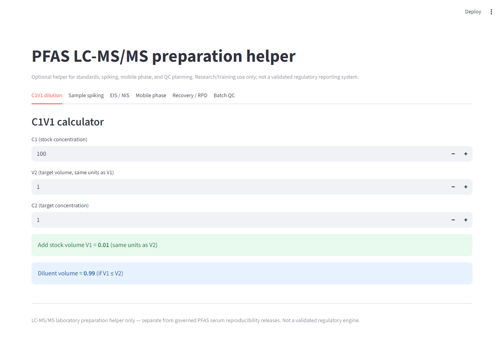
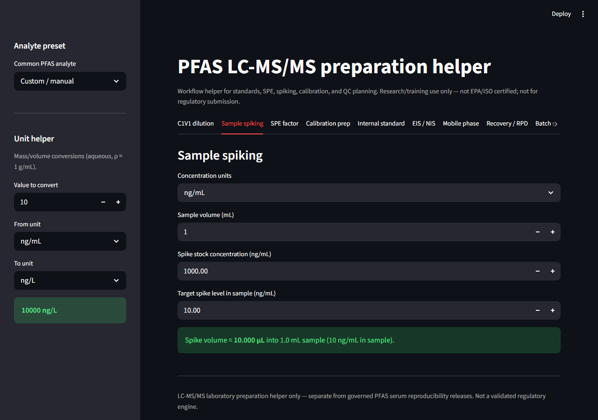
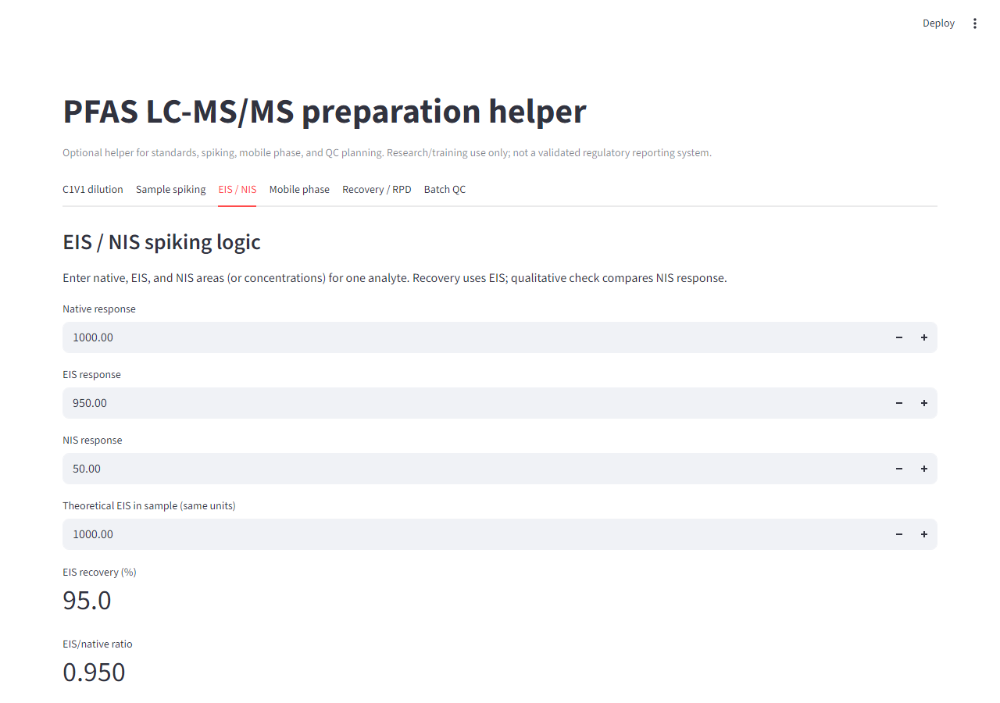
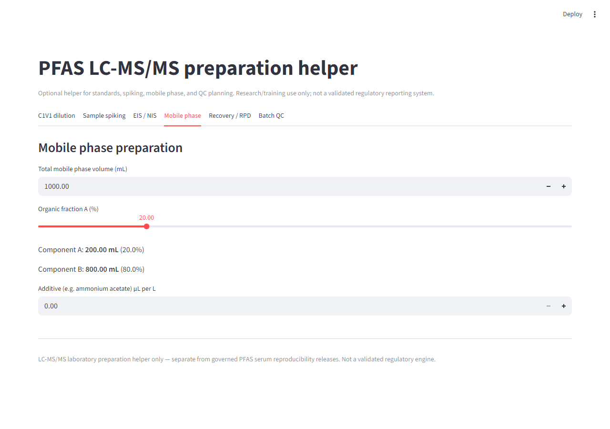
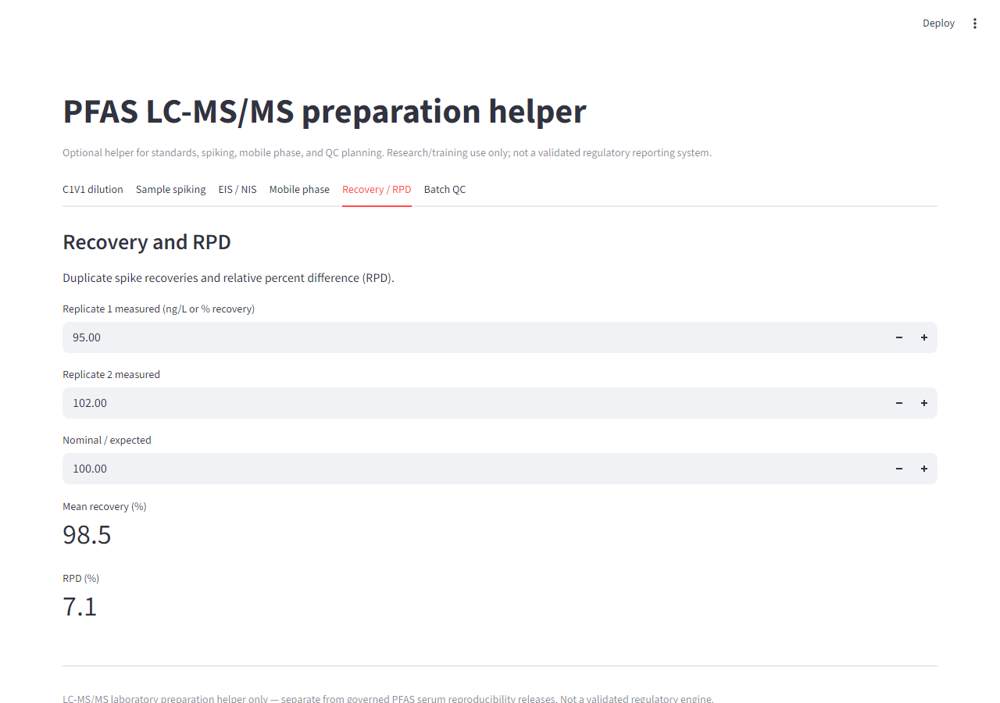
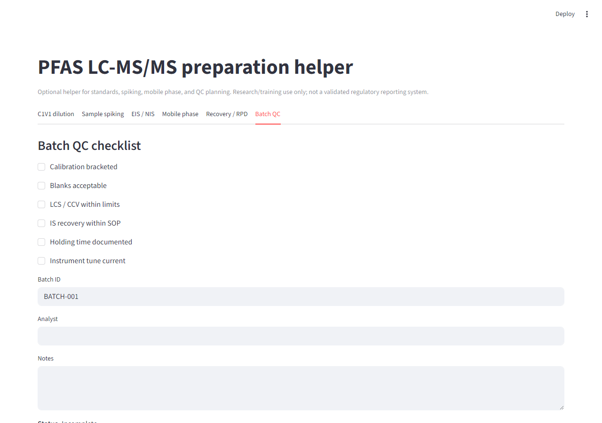

# PFAS LC-MS/MS preparation helper

Research-use-only (RUO) LC-MS/MS preparation helper for PFAS workflows, standards preparation, spiking calculations, QC planning, and laboratory support.

This utility is intentionally separate from governed reproducibility workflows and frozen analytical releases.

**Not EPA-certified.**  
**Not ISO-certified software.**  
**Not intended for regulatory submission.**  
**Not a validated reporting platform.**

## Features

**Phase 1 — laboratory workflow helpers**

- C1V1 dilution calculator
- PFAS **analyte presets** (PFOS, PFOA, PFHxS, PFNA, PFBS, GenX) — MW, calibration range, suggested IS
- **SPE concentration factor** + sample-equivalent back-calculation
- **Calibration prep table** (ng/L levels → stock µL + diluent) with CSV export
- **Internal standard spiking** (MPFAC-MXA / Wellington-style starting values)
- Sample spiking + **unit helper** (ng/L ↔ ng/mL ↔ µg/L, etc.)
- EIS/NIS response check, recovery/RPD, mobile phase, batch QC CSV

**Phase 2 (in progress)**

- **Recovery PASS/WARN/FAIL** — configurable limits, suggested interpretation (RUO; review per SOP)
- *Planned:* mobile phase chemistry helper, batch sequence planner

## Scientific positioning

| This calculator | Governed serum release (separate repo) |
|-----------------|----------------------------------------|
| Lab helper / training utility | Reproducibility evidence |
| Preparation calculations | Frozen analytical release |
| Optional workflow support | Provenance + blind verification |

Do **not** cite the serum reproducibility Zenodo DOI for this tool. If you publish this calculator later, use its **own** repository tag and DOI (e.g. `lcms-tools-v1.0.0`).

Repository: https://github.com/Ishola-github/lcms-calculator

## Setup

```powershell
cd C:\Users\techj\Downloads\lcms_calculator
python -m venv .venv
# If Activate.ps1 is blocked, use either:
#   Set-ExecutionPolicy -Scope CurrentUser RemoteSigned
#   .\.venv\Scripts\python.exe -m pip install -r requirements.txt
.\.venv\Scripts\python.exe -m pip install -r requirements.txt
.\.venv\Scripts\python.exe -m streamlit run pfas_lcmsms_calculator_app.py
```

Open http://localhost:8501

## Screenshots

| C1V1 dilution | Sample spiking |
|:---:|:---:|
|  |  |

| EIS / NIS | Mobile phase |
|:---:|:---:|
|  |  |

| Recovery / RPD | Batch QC |
|:---:|:---:|
|  |  |

Full-width overview: `screenshots/00_overview_c1v1.png`. See [screenshots/README.md](screenshots/README.md) for filenames and optional regeneration steps.

## Repository layout

```text
lcms_calculator/
├── pfas_lcmsms_calculator_app.py
├── requirements.txt
├── README.md
├── examples/
├── screenshots/
└── scripts/          # optional dev utilities (screenshot capture)
```

Do **not** run `git add .` inside `pfas-toxicology/pfas-toxicology`.
